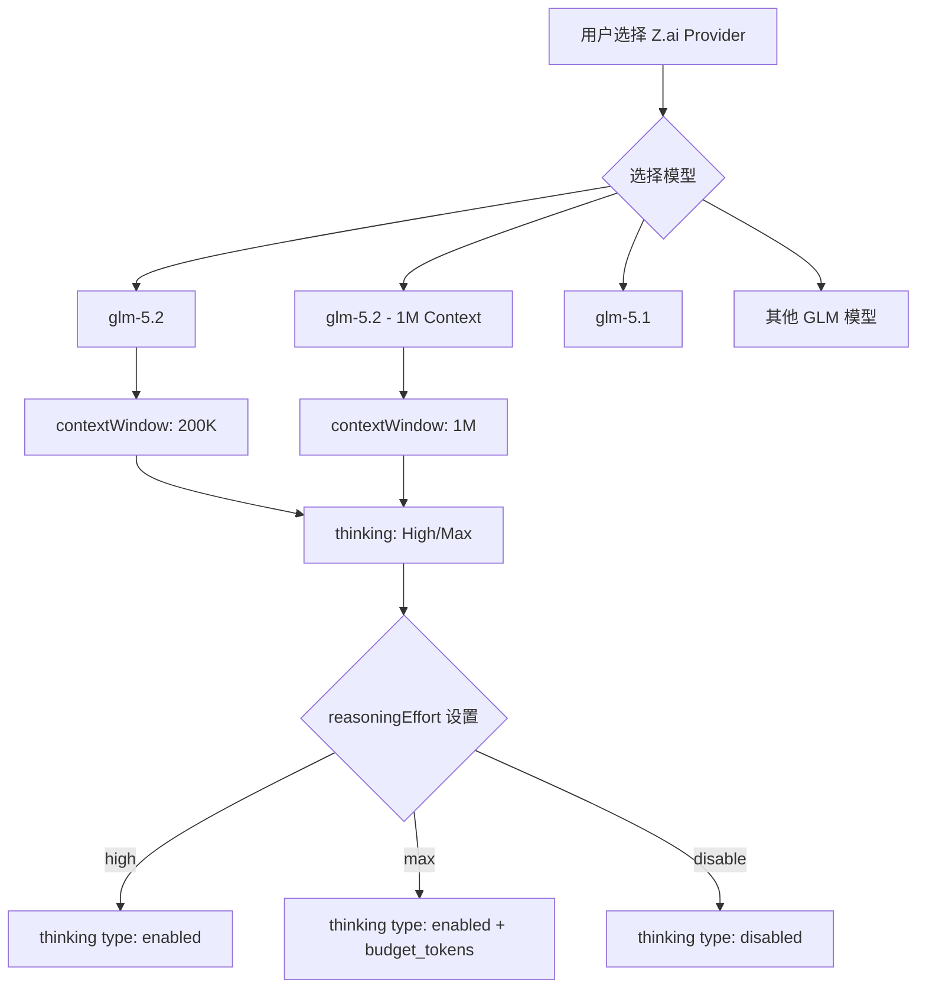

# GLM-5.2 适配计划

## 1. 模型信息概览

### GLM-5.2 核心规格

| 属性            | GLM-5.2                                      | GLM-5.1（对比）      |
| --------------- | -------------------------------------------- | -------------------- |
| 发布日期        | 2026-06-13                                   | 2026-04-07           |
| 上下文窗口      | 1,000,000 tokens（`glm-5.2[1m]`）/ 默认 200K | ~200,000 tokens      |
| 最大输出 tokens | 131,072                                      | 131,072              |
| 思考模式        | High / Max 两种力度                          | 单一模式（medium）   |
| 架构            | 744B MoE, 40B active（GLM-5 血统）           | 744B MoE, 40B active |
| 许可证          | MIT（下周开源）                              | MIT                  |
| API 兼容        | OpenAI Compatible                            | OpenAI Compatible    |

### API 端点

| 线路        | Base URL                                      |
| ----------- | --------------------------------------------- |
| 国际 Coding | `https://api.z.ai/api/coding/paas/v4`         |
| 中国 Coding | `https://open.bigmodel.cn/api/coding/paas/v4` |
| 国际 API    | `https://api.z.ai/api/paas/v4`                |
| 中国 API    | `https://open.bigmodel.cn/api/paas/v4`        |

### 定价（中国 API，元/百万tokens）

| 上下文长度 | 输入 | 输出 | 缓存命中 |
| ---------- | ---- | ---- | -------- |
| [0, 32K)   | 4    | 18   | 1        |
| [32K+)     | 6    | 22   | 1.5      |

### 定价（国际 API，$/百万tokens）

| 上下文长度 | 输入  | 输出  | 缓存命中 |
| ---------- | ----- | ----- | -------- |
| [0, 32K)   | ~0.57 | ~2.57 | ~0.14    |
| [32K+)     | ~0.86 | ~3.14 | ~0.20    |

## 2. 关键差异分析

### 2.1 上下文窗口扩展

GLM-5.2 最大的变化是支持 **1M 上下文窗口**，通过模型名后缀 `[1m]` 启用：

- `glm-5.2` → 默认 200K 上下文
- `glm-5.2[1m]` → 1M 上下文

这需要在模型定义中支持两种变体，或者在 UI 中允许用户选择上下文窗口大小。

### 2.2 思考模式变化

GLM-5.2 引入了两种思考力度：

- **High**：标准思考模式
- **Max**：深度思考模式，推荐用于复杂编码任务

现有 GLM-5/5.1 使用 `supportsReasoningEffort: ["disable", "medium"]`，需要扩展为支持 High/Max。

### 2.3 阶梯定价

GLM-5.2 采用按上下文长度阶梯定价，这与现有模型的单一价格不同。由于 Kilo Code 的 `ModelInfo` 类型使用单一 `inputPrice`/`outputPrice` 字段，我们采用 32K 以下的价格作为基准价格（更常用），在 description 中说明阶梯定价。

## 3. 适配架构



## 4. 需要修改的文件

### 4.1 `packages/types/src/providers/zai.ts`

**变更内容：**

1. 添加 `glm-5.2` 模型定义（国际 + 国内两套）
2. 添加 `glm-5.2-1m` 模型定义（1M 上下文变体）
3. 更新默认模型 ID 为 `glm-5.2`
4. 更新 `supportsReasoningEffort` 为 `["disable", "high", "max"]`

**模型定义参数：**

```typescript
// 国际版
"glm-5.2": {
    maxTokens: 131_072,
    contextWindow: 200_000,
    supportsImages: false,
    supportsPromptCache: true,
    supportsNativeTools: true,
    defaultToolProtocol: "native",
    supportsReasoningEffort: ["disable", "high", "max"],
    reasoningEffort: "max",
    preserveReasoning: true,
    inputPrice: 0.57,
    outputPrice: 2.57,
    cacheWritesPrice: 0,
    cacheReadsPrice: 0.14,
    description: "GLM-5.2 is Z.AI's latest flagship model with 200K context, 128K max output, dual thinking modes (High/Max), function calling, and context caching. Max effort recommended for coding.",
    preferredIndex: 0,
},
"glm-5.2-1m": {
    maxTokens: 131_072,
    contextWindow: 1_000_000,
    supportsImages: false,
    supportsPromptCache: true,
    supportsNativeTools: true,
    defaultToolProtocol: "native",
    supportsReasoningEffort: ["disable", "high", "max"],
    reasoningEffort: "max",
    preserveReasoning: true,
    inputPrice: 0.86,
    outputPrice: 3.14,
    cacheWritesPrice: 0,
    cacheReadsPrice: 0.20,
    description: "GLM-5.2 with 1M token context window. Enables whole-repository loading in a single context. Tiered pricing: higher rates apply for inputs over 32K tokens.",
},
```

```typescript
// 国内版
"glm-5.2": {
    maxTokens: 131_072,
    contextWindow: 200_000,
    supportsImages: false,
    supportsPromptCache: true,
    supportsNativeTools: true,
    defaultToolProtocol: "native",
    supportsReasoningEffort: ["disable", "high", "max"],
    reasoningEffort: "max",
    preserveReasoning: true,
    inputPrice: 4,
    outputPrice: 18,
    cacheWritesPrice: 0,
    cacheReadsPrice: 1,
    description: "GLM-5.2 是智谱最新旗舰模型，200K 上下文，128K 最大输出，双思考模式（High/Max），支持函数调用和上下文缓存。推荐编码任务使用 Max 思考力度。",
    preferredIndex: 0,
},
"glm-5.2-1m": {
    maxTokens: 131_072,
    contextWindow: 1_000_000,
    supportsImages: false,
    supportsPromptCache: true,
    supportsNativeTools: true,
    defaultToolProtocol: "native",
    supportsReasoningEffort: ["disable", "high", "max"],
    reasoningEffort: "max",
    preserveReasoning: true,
    inputPrice: 6,
    outputPrice: 22,
    cacheWritesPrice: 0,
    cacheReadsPrice: 1.5,
    description: "GLM-5.2 1M 上下文版本，可在单次对话中加载整个中型代码仓库。阶梯定价：输入超过 32K tokens 时适用更高费率。",
},
```

### 4.2 `src/api/providers/zai.ts`

**变更内容：**

1. 适配 GLM-5.2 的 `reasoningEffort` 映射逻辑

    - `high` → `thinking: { type: "enabled" }`
    - `max` → `thinking: { type: "enabled", budget_tokens: maxTokens }`
    - `disable` → `thinking: { type: "disabled" }`

2. 现有 `createStreamWithThinking` 方法需要扩展以支持 `budget_tokens` 参数

### 4.3 `src/api/providers/__tests__/zai.spec.ts`

**变更内容：**

1. 添加 `glm-5.2` 模型的测试用例
2. 添加 `glm-5.2-1m` 模型的测试用例
3. 测试 High/Max 思考模式的参数传递
4. 测试 disable 模式正确禁用思考

### 4.4 `.changeset/` 目录

创建 changeset 文件，标记为 `minor`（新功能）。

## 5. 实现步骤

### Step 1: 更新模型定义

在 `packages/types/src/providers/zai.ts` 中：

- 在 `internationalZAiModels` 中添加 `glm-5.2` 和 `glm-5.2-1m`
- 在 `mainlandZAiModels` 中添加 `glm-5.2` 和 `glm-5.2-1m`
- 更新 `internationalZAiDefaultModelId` 为 `"glm-5.2"`
- 更新 `mainlandZAiDefaultModelId` 为 `"glm-5.2"`
- 调整现有模型的 `preferredIndex`（glm-5 → 1, glm-4.7 → 2, glm-4.7-flash → 3）

### Step 2: 适配 thinking 模式

在 `src/api/providers/zai.ts` 中：

- 扩展 `ZAiChatCompletionParams` 类型，支持 `thinking` 的 `budget_tokens` 字段
- 修改 `createStreamWithThinking` 方法，根据 `reasoningEffort` 设置不同的 thinking 参数
- `max` 模式下设置 `budget_tokens` 为较大的值（如 `maxTokens` 的 80%）

### Step 3: 更新测试

在 `src/api/providers/__tests__/zai.spec.ts` 中：

- 添加 glm-5.2 模型获取测试
- 添加 glm-5.2-1m 模型获取测试
- 添加 High/Max reasoning effort 参数传递测试
- 添加 disable reasoning 测试

### Step 4: 创建 changeset

```markdown
---
"kilo-code": minor
---

添加 GLM-5.2 模型支持，包括 1M 上下文窗口变体和 High/Max 双思考模式
```

## 6. 注意事项

1. **`[1m]` 后缀处理**：Z.AI 官方使用 `glm-5.2[1m]` 作为模型 ID，但方括号在模型选择器中可能造成显示问题。我们使用 `glm-5.2-1m` 作为内部 ID，在发送 API 请求时映射为 `glm-5.2[1m]`。

2. **阶梯定价**：由于 `ModelInfo` 类型不支持阶梯定价，我们使用 32K 以下的价格作为基准，在 description 中说明阶梯定价规则。

3. **kilocode_change 标记**：所有对 `packages/types/src/providers/zai.ts` 和 `src/api/providers/zai.ts` 的修改都需要添加 `kilocode_change` 标记，因为这些文件存在于上游 Roo Code 中。

4. **向后兼容**：保留所有现有模型定义，不删除任何已有模型。`glm-5.1` 继续可用。

5. **reasoningEffort 值域**：GLM-5.2 的 reasoningEffort 值域为 `["disable", "high", "max"]`，与 GLM-5/5.1 的 `["disable", "medium"]` 不同。需要在 `shouldUseReasoningEffort` 逻辑中正确处理。
