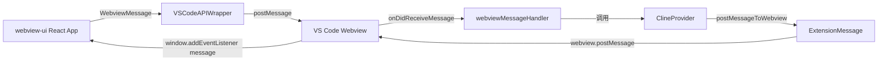
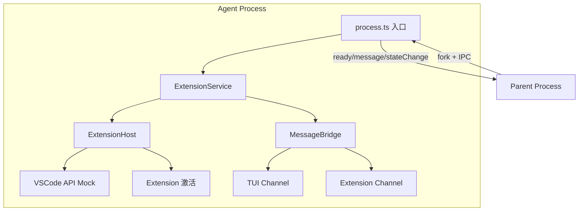
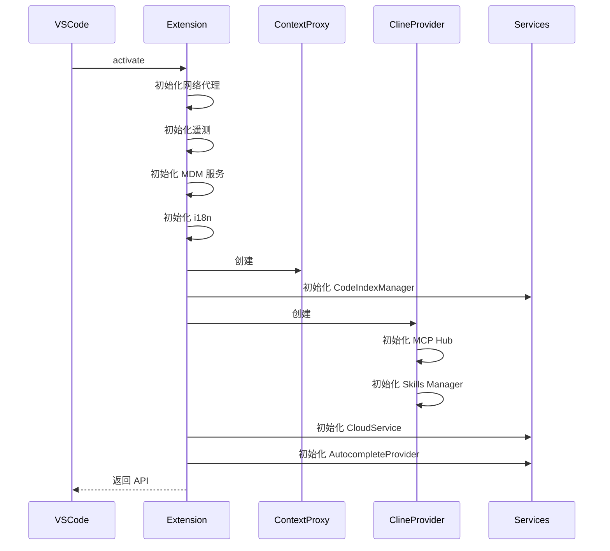
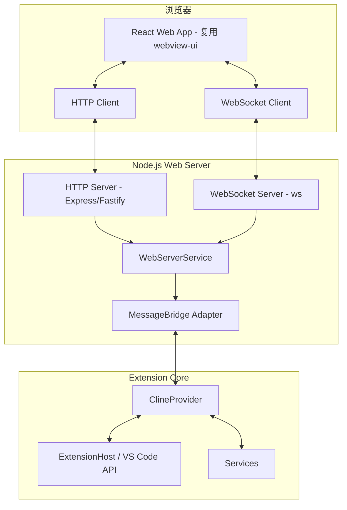

# Kilo Code Web 端功能可行性研究报告

## 概述

本报告研究了 Kilo Code 代码库的现有架构，评估了在插件中添加 Web 端访问功能的技术可行性。用户可以在插件设置中开启 Web 服务，然后通过浏览器使用该插件。

---

## 1. 插件设置系统

### 1.1 设置 UI 实现

**关键文件：**

- [`SettingsView.tsx`](webview-ui/src/components/settings/SettingsView.tsx) — 主设置 UI 容器（50,604 字符）
- [`ApiOptions.tsx`](webview-ui/src/components/settings/ApiOptions.tsx) — API 提供商配置（42,665 字符）
- [`ExperimentalSettings.tsx`](webview-ui/src/components/settings/ExperimentalSettings.tsx) — 实验性功能设置
- [`AutoApproveSettings.tsx`](webview-ui/src/components/settings/AutoApproveSettings.tsx) — 自动批准配置
- [`TerminalSettings.tsx`](webview-ui/src/components/settings/TerminalSettings.tsx) — 终端设置
- [`BrowserSettings.tsx`](webview-ui/src/components/settings/BrowserSettings.tsx) — 浏览器设置
- [`ContextManagementSettings.tsx`](webview-ui/src/components/settings/ContextManagementSettings.tsx) — 上下文管理设置

**设计模式：**

- 设置 UI 使用 React 组件，通过 `useExtensionState()` Hook 读写状态
- 每个设置分类有独立的组件文件
- API 提供商配置有 50+ 个独立组件在 `providers/` 子目录中

### 1.2 数据模型与状态管理

**关键文件：**

- [`ExtensionStateContext.tsx`](webview-ui/src/context/ExtensionStateContext.tsx) — 中央状态管理（773 行）
- [`ContextProxy`](src/core/config/ContextProxy.ts) — 封装 VS Code 的 `globalState` 和 `SecretStorage`
- [`ProviderSettingsManager`](src/core/config/ProviderSettingsManager.ts) — 管理提供商配置文件
- [`CustomModesManager`](src/core/config/CustomModesManager.ts) — 管理自定义模式

**状态管理模式：**

```
ExtensionStateContext (React Context)
    ↕ postMessage
ClineProvider
    ↕ ContextProxy
VS Code globalState / SecretStorage
```

**添加新设置项的步骤：**

1. 在 [`packages/types/src/global-settings.ts`](packages/types/src/global-settings.ts) 中添加类型定义
2. 在 [`ContextProxy`](src/core/config/ContextProxy.ts) 中注册状态键
3. 在 [`ClineProvider.getState()`](src/core/webview/ClineProvider.ts:2585) 中暴露状态
4. 在 [`ClineProvider.getStateToPostToWebview()`](src/core/webview/ClineProvider.ts:2202) 中包含状态
5. 在 [`ExtensionStateContext`](webview-ui/src/context/ExtensionStateContext.tsx) 中添加对应的 setter
6. 在 [`webviewMessageHandler`](src/core/webview/webviewMessageHandler.ts) 中添加消息处理
7. 在设置 UI 组件中添加对应的表单控件

---

## 2. Webview 通信机制

### 2.1 消息传递架构



**关键文件：**

- [`vscode.ts`](webview-ui/src/utils/vscode.ts) — `VSCodeAPIWrapper` 封装 `acquireVsCodeApi()`
- [`WebviewMessage`](packages/types/src/vscode-extension-host.ts:714) — Webview → Extension 消息类型（~300 种 type）
- [`ExtensionMessage`](packages/types/src/vscode-extension-host.ts:138) — Extension → Webview 消息类型（~150 种 type）
- [`webviewMessageHandler.ts`](src/core/webview/webviewMessageHandler.ts) — 处理所有 Webview 消息（161,700 字符）
- [`ClineProvider.ts`](src/core/webview/ClineProvider.ts) — 核心桥接类（155,767 字符）

### 2.2 消息类型

**WebviewMessage**（Webview → Extension）主要类型：

- `webviewDidLaunch` — Webview 初始化完成
- `newTask` / `askResponse` — 任务创建和响应
- `mode` — 模式切换
- 各种设置更新（`autoApprovalEnabled`, `telemetrySetting` 等）
- MCP 操作（`openMcpSettings`, `restartMcpServer` 等）
- 任务历史操作（`showTaskWithId`, `deleteTaskWithId` 等）

**ExtensionMessage**（Extension → Webview）主要类型：

- `state` — 完整状态同步
- `messageUpdated` — 聊天消息更新
- `action` — UI 操作指令
- `invoke` — 调用 Webview 函数
- 各种模型列表响应

### 2.3 浏览器兼容性

[`VSCodeAPIWrapper`](webview-ui/src/utils/vscode.ts:17) 已有浏览器回退逻辑：

```typescript
// postMessage 回退到 console.log
postMessage(message: unknown) {
    this.vscodeApi?.postMessage(message) ?? console.log(message)
}

// getState/setState 回退到 localStorage
getState(): unknown {
    return this.vscodeApi?.getState() ?? localStorage.getItem(...)
}
```

这是一个重要发现 — 现有代码已经考虑了非 VS Code 环境的运行场景。

---

## 3. i18n/多语言系统

### 3.1 实现架构

**关键文件：**

- [`src/i18n/index.ts`](src/i18n/index.ts) — 后端 i18n 入口（使用 i18next）
- [`src/i18n/setup.ts`](src/i18n/setup.ts) — i18next 初始化配置
- [`TranslationContext.tsx`](webview-ui/src/i18n/TranslationContext.tsx) — 前端翻译 Context
- [`webview-ui/src/i18n/locales/`](webview-ui/src/i18n/locales/) — 翻译文件目录

**支持的语言（17 种）：**
`ar`, `cs`, `es`, `hi`, `id`, `it`, `ko`, `pl`, `pt-BR`, `ru`, `sk`, `th`, `tr`, `uk`, `vi`, `zh-CN`, `en`（默认）

**命名空间（每个语言 13 个 JSON 文件）：**
`account`, `agentManager`, `chat`, `cloud`, `common`, `history`, `humanRelay`, `kilocode`, `marketplace`, `mcp`, `prompts`, `settings`, `welcome`

### 3.2 添加新翻译键

1. 在 `webview-ui/src/i18n/locales/en/` 下的对应命名空间 JSON 中添加英文键
2. 在其他 16 种语言的对应文件中添加翻译
3. 使用 `useAppTranslation()` Hook 或 `t()` 函数引用

---

## 4. 现有服务架构

### 4.1 服务目录结构

```
src/services/
├── auto-purge/        # 自动清理调度器
├── autocomplete/      # 自动补全服务 [Kilo Code 专属]
├── browser/           # 浏览器自动化服务
├── checkpoints/       # 检查点服务
├── code-index/        # 代码索引服务
├── command/           # 命令服务
├── commit-message/    # 提交消息生成
├── config/            # 配置服务
├── contribution-tracking/
├── glob/              # Glob 模式匹配
├── kilo-session/      # 会话管理 [Kilo Code 专属]
├── kilocode/          # Kilo Code 专属服务
├── marketplace/       # MCP 市场
├── mcp/               # MCP 服务
├── mdm/               # MDM 服务
├── mocking/           # Mock 服务
├── review/            # 代码审查
├── ripgrep/           # 搜索工具
├── roo-config/        # Roo 配置
├── search/            # 搜索服务
├── settings-sync/     # 设置同步
├── skills/            # 技能管理
├── stt/               # 语音转文字
├── terminal-welcome/  # 终端欢迎
├── tree-sitter/       # 语法解析
```

### 4.2 服务注册模式

**关键发现：没有现有的 HTTP/WebSocket 服务。** 所有服务都是通过 VS Code Extension API 运行的。

服务注册模式（在 [`src/extension.ts`](src/extension.ts) 中）：

```typescript
export async function activate(context: vscode.ExtensionContext) {
	// 1. 初始化基础设施
	// 2. 创建 ContextProxy
	// 3. 初始化 CodeIndexManager
	// 4. 创建 ClineProvider
	// 5. 初始化 CloudService
	// 6. 初始化 AutocompleteProvider
	// 7. 启动设置同步
	// 8. 返回 API
	return new API(outputChannel, provider, socketPath, enableLogging)
}
```

每个服务被推入 `context.subscriptions` 用于生命周期管理。

---

## 5. Agent Runtime 架构

### 5.1 核心组件



**关键文件：**

- [`process.ts`](packages/agent-runtime/src/process.ts) — Agent 进程入口（531 行）
- [`ExtensionHost.ts`](packages/agent-runtime/src/host/ExtensionHost.ts) — VS Code API Mock + 扩展宿主（47,367 字符）
- [`VSCode.ts`](packages/agent-runtime/src/host/VSCode.ts) — 完整的 VS Code API 模拟（76,376 字符）
- [`extension.ts`](packages/agent-runtime/src/services/extension.ts) — 服务编排层（505 行）
- [`ipc.ts`](packages/agent-runtime/src/communication/ipc.ts) — IPC 通信层（230 行）

### 5.2 关键设计模式

**ExtensionHost** 提供了完整的 VS Code API Mock，包括：

- `workspace`, `window`, `commands`, `extensions` 等
- `globalState`, `SecretStorage` 的文件系统实现
- `WebviewViewProvider` 的模拟实现

**MessageBridge** 提供了双向通信：

- `IPCChannel` — 基于事件驱动的请求/响应通道
- 超时机制（默认 30 秒）
- 请求 ID 追踪

**配置注入：**

```typescript
// 通过 AGENT_CONFIG 环境变量传入配置
const config = JSON.parse(process.env.AGENT_CONFIG)
// 包含: workspace, providerSettings, mode, customModes, autoApprove 等
```

### 5.3 对 Web 端的复用价值

Agent Runtime 的架构可以直接复用于 Web 端：

1. **ExtensionHost** 可以作为 Web 端后端的核心
2. **MessageBridge** 的 IPC 模式可以替换为 WebSocket
3. **ExtensionService** 的事件驱动接口可以直接桥接到 HTTP/WebSocket

---

## 6. 核心扩展入口

### 6.1 扩展激活流程

[`src/extension.ts`](src/extension.ts) 的 `activate()` 函数执行以下步骤：



### 6.2 扩展生命周期

- **激活**：当 VS Code 打开或用户触发命令时
- **运行**：ClineProvider 管理 Webview 和任务生命周期
- **停用**：清理所有服务和 disposable 资源

### 6.3 在扩展激活时启动 Web 服务

可以在 `activate()` 函数中添加 Web 服务启动逻辑：

```typescript
// 在 activate() 末尾，provider 创建之后
if (state.webServerEnabled) {
	const webServer = new WebServerService(provider, {
		port: state.webServerPort || 3000,
		authToken: generateAuthToken(),
	})
	context.subscriptions.push(webServer)
}
```

---

## 7. 技术可行性评估

### 7.1 整体可行性：✅ 高度可行

基于以下关键发现：

1. **Agent Runtime 已证明无 VS Code 运行的可行性** — `packages/agent-runtime/` 已经实现了完整的 VS Code API Mock，可以在独立 Node.js 进程中运行扩展

2. **Webview UI 已有浏览器回退** — `VSCodeAPIWrapper` 已经处理了非 VS Code 环境

3. **消息协议已标准化** — `WebviewMessage` 和 `ExtensionMessage` 类型定义清晰，可以直接映射到 WebSocket 协议

4. **服务架构松耦合** — 服务通过事件和接口通信，易于替换底层传输

### 7.2 推荐技术方案



**推荐 HTTP 框架：Fastify**

- 轻量高性能
- 原生 TypeScript 支持
- 插件生态丰富
- 比 Express 更现代

**推荐 WebSocket 库：ws**

- Node.js 生态最成熟的 WebSocket 库
- 轻量、高性能
- 与 Fastify 集成良好

### 7.3 架构方案选择

**方案 A：在扩展进程中运行（推荐）**

```
VS Code Extension Process
├── ClineProvider (现有)
├── WebServerService (新增)
│   ├── HTTP Server (提供静态文件)
│   └── WebSocket Server (双向通信)
└── 其他现有服务
```

优点：

- 直接访问 ClineProvider，无需 IPC
- 实现简单，延迟最低
- 与现有架构一致

缺点：

- Web 服务与扩展共享进程

**方案 B：复用 Agent Runtime（备选）**

```
VS Code Extension Process
├── ClineProvider (现有)
├── WebServerService (新增)
│   ├── HTTP Server
│   └── WebSocket Server
│       └── 通过 IPC 连接到 fork 出的 Agent Process
└── 其他现有服务
```

优点：

- 隔离性更好
- 可复用 Agent Runtime 的成熟架构

缺点：

- 多一层 IPC，增加复杂度和延迟
- 需要处理 Agent 进程的生命周期

### 7.4 安全方案

1. **认证**：

    - 首次启动时生成随机 Token
    - 在 VS Code 中显示 Token 供用户输入
    - 支持 Token + QR 码方式
    - 可选：支持设备授权流（已有 [`DeviceAuthHandler`](src/core/kilocode/webview/deviceAuthHandler.ts) 可参考）

2. **传输安全**：

    - 默认仅监听 `localhost`
    - 可选启用 HTTPS（自签名证书）
    - WebSocket 支持 `wss://`

3. **CORS**：

    - 仅允许来自 Web 服务自身的请求
    - 禁止跨域访问

4. **速率限制**：
    - 对 API 端点实施速率限制
    - 防止暴力破解 Token

---

## 8. 潜在架构风险和挑战

### 8.1 高风险

| 风险                           | 影响                                       | 缓解措施                     |
| ------------------------------ | ------------------------------------------ | ---------------------------- |
| VS Code API 依赖               | Webview UI 大量使用 VS Code CSS 变量和主题 | 需要创建 CSS 变量回退方案    |
| `webviewMessageHandler` 紧耦合 | 161K 字符的巨型文件，大量使用 `vscode` API | 需要提取可复用的消息处理逻辑 |
| CSP 限制                       | VS Code Webview 有严格的 CSP 策略          | Web 端需要独立的 CSP 配置    |

### 8.2 中等风险

| 风险         | 影响                                        | 缓解措施                                    |
| ------------ | ------------------------------------------- | ------------------------------------------- |
| 上游合并冲突 | 修改 `ClineProvider` 等核心文件可能导致冲突 | 使用 `kilocode_change` 标记，尽量创建新文件 |
| 文件系统操作 | 浏览器无法直接访问文件系统                  | 通过 WebSocket 代理到后端                   |
| 终端操作     | 浏览器无法运行终端命令                      | 通过 WebSocket 代理，使用 xterm.js          |

### 8.3 低风险

| 风险        | 影响                       | 缓解措施                               |
| ----------- | -------------------------- | -------------------------------------- |
| i18n 兼容性 | Web 端需要独立加载翻译文件 | 已有 i18next，可直接复用               |
| 状态同步    | 多客户端同时连接           | 已有 `postStateToWebview` 模式，可广播 |

---

## 9. 实施计划概要

### Phase 1：基础架构

1. 创建 `src/services/web-server/` 服务目录（Kilo Code 专属，无需 `kilocode_change` 标记）
2. 实现 `WebServerService` 类（HTTP + WebSocket）
3. 在设置系统中添加 Web 服务开关和端口配置
4. 在 `activate()` 中注册 Web 服务

### Phase 2：通信桥接

5. 实现 WebSocket → ClineProvider 消息桥接
6. 创建 `WebviewMessage` 到 WebSocket 的适配器
7. 处理 `ExtensionMessage` 到 WebSocket 的广播

### Phase 3：Web 前端

8. 创建 Web 端独立入口（复用 `webview-ui/` 代码）
9. 实现 WebSocket 替代 `VSCodeAPIWrapper` 的通信层
10. 处理 VS Code CSS 变量的回退方案

### Phase 4：安全与完善

11. 实现 Token 认证机制
12. 添加 HTTPS 支持
13. 实现速率限制
14. 添加 i18n 翻译键
15. 编写测试

---

## 10. 关键文件索引

| 类别               | 文件路径                                                                                                     | 说明                      |
| ------------------ | ------------------------------------------------------------------------------------------------------------ | ------------------------- |
| 扩展入口           | [`src/extension.ts`](src/extension.ts)                                                                       | activate/deactivate       |
| 核心桥接           | [`src/core/webview/ClineProvider.ts`](src/core/webview/ClineProvider.ts)                                     | Webview ↔ Extension 桥梁 |
| 消息处理           | [`src/core/webview/webviewMessageHandler.ts`](src/core/webview/webviewMessageHandler.ts)                     | 所有 Webview 消息处理     |
| 状态管理           | [`webview-ui/src/context/ExtensionStateContext.tsx`](webview-ui/src/context/ExtensionStateContext.tsx)       | React 状态管理            |
| VS Code API 封装   | [`webview-ui/src/utils/vscode.ts`](webview-ui/src/utils/vscode.ts)                                           | postMessage 封装          |
| 消息类型           | [`packages/types/src/vscode-extension-host.ts`](packages/types/src/vscode-extension-host.ts)                 | 所有消息类型定义          |
| 全局设置           | [`packages/types/src/global-settings.ts`](packages/types/src/global-settings.ts)                             | 设置数据模型              |
| 配置代理           | [`src/core/config/ContextProxy.ts`](src/core/config/ContextProxy.ts)                                         | 状态持久化                |
| Agent Runtime 入口 | [`packages/agent-runtime/src/process.ts`](packages/agent-runtime/src/process.ts)                             | Agent 进程入口            |
| ExtensionHost      | [`packages/agent-runtime/src/host/ExtensionHost.ts`](packages/agent-runtime/src/host/ExtensionHost.ts)       | VS Code API Mock          |
| VSCode Mock        | [`packages/agent-runtime/src/host/VSCode.ts`](packages/agent-runtime/src/host/VSCode.ts)                     | 完整 API 模拟             |
| IPC 通信           | [`packages/agent-runtime/src/communication/ipc.ts`](packages/agent-runtime/src/communication/ipc.ts)         | 双向 IPC                  |
| 服务编排           | [`packages/agent-runtime/src/services/extension.ts`](packages/agent-runtime/src/services/extension.ts)       | ExtensionService          |
| i18n 后端          | [`src/i18n/index.ts`](src/i18n/index.ts)                                                                     | 后端翻译                  |
| i18n 前端          | [`webview-ui/src/i18n/TranslationContext.tsx`](webview-ui/src/i18n/TranslationContext.tsx)                   | 前端翻译                  |
| 设置 UI            | [`webview-ui/src/components/settings/SettingsView.tsx`](webview-ui/src/components/settings/SettingsView.tsx) | 设置界面                  |
