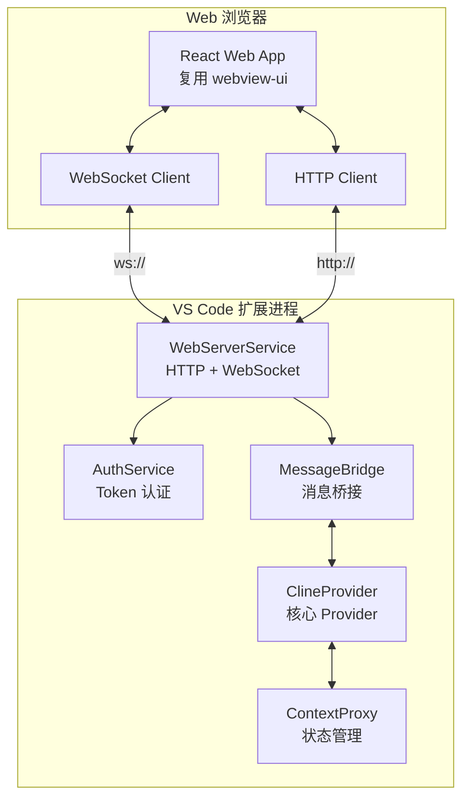
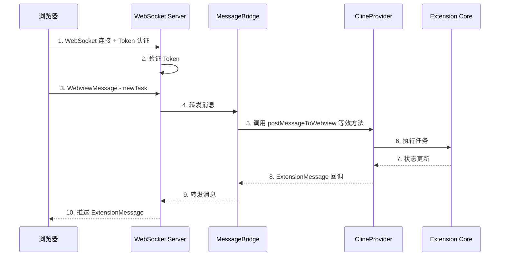
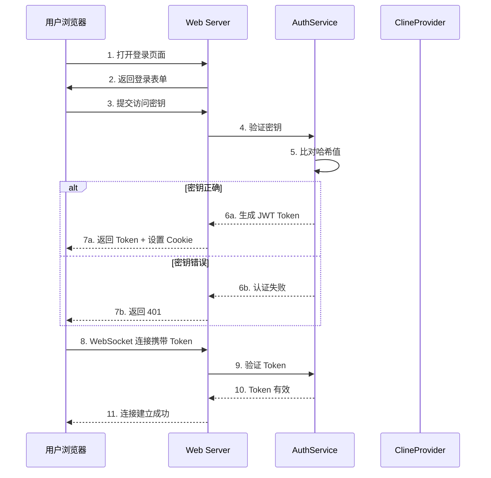
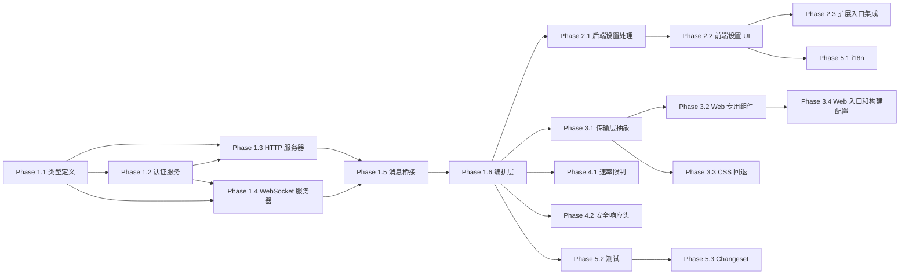

# Kilo Code Web 端访问功能 - 详细实施计划

## 1. 架构设计

### 1.1 整体架构

采用**方案 A：在扩展进程中运行**，Web Server 作为扩展进程内的一个服务运行，直接访问 [`ClineProvider`](src/core/webview/ClineProvider.ts)。



### 1.2 数据流设计



### 1.3 模块划分

| 模块             | 职责                                | 位置                                                           |
| ---------------- | ----------------------------------- | -------------------------------------------------------------- |
| WebServerService | HTTP + WebSocket 服务器生命周期管理 | `src/services/web-server/`                                     |
| AuthService      | Token 生成、验证、刷新              | `src/services/web-server/auth.ts`                              |
| MessageBridge    | WebSocket ↔ ClineProvider 消息桥接 | `src/services/web-server/bridge.ts`                            |
| WebClient        | Web 前端（复用 webview-ui）         | `webview-ui/src/transport/` + `webview-ui/src/components/web/` |
| WebSettings      | Web Server 设置 UI                  | `webview-ui/src/components/settings/WebServerSettings.tsx`     |

---

## 2. 新增文件清单

### 2.1 后端服务文件

#### `src/services/web-server/index.ts`

- **职责**：服务入口，导出 `WebServerService`
- **关键接口**：

```typescript
export class WebServerService implements vscode.Disposable {
	constructor(provider: ClineProvider, contextProxy: ContextProxy, config: WebServerConfig)
	async start(): Promise<void>
	async stop(): Promise<void>
	dispose(): void
}
```

#### `src/services/web-server/types.ts`

- **职责**：Web Server 相关类型定义
- **关键接口**：

```typescript
export interface WebServerConfig {
	enabled: boolean
	port: number
	accessToken: string
}

export interface WebServerState {
	running: boolean
	port: number
	connections: number
	url: string
}

export interface AuthenticatedWebSocket extends WebSocket {
	isAuthenticated: boolean
	sessionId: string
}
```

#### `src/services/web-server/auth.ts`

- **职责**：Token 认证服务
- **关键接口**：

```typescript
export class AuthService {
	private readonly secretKey: Buffer // 从用户设置的访问密钥派生
	generateToken(): string // 生成 JWT Token
	validateToken(token: string): boolean // 验证 Token
	hashPassword(password: string): string // 哈希访问密钥
	verifyPassword(password: string, hash: string): boolean
}
```

#### `src/services/web-server/bridge.ts`

- **职责**：WebSocket ↔ ClineProvider 消息桥接
- **关键接口**：

```typescript
export class MessageBridge {
	constructor(provider: ClineProvider)
	handleWebviewMessage(message: WebviewMessage, ws: AuthenticatedWebSocket): void
	broadcastToClients(message: ExtensionMessage): void
	registerClient(ws: AuthenticatedWebSocket): void
	unregisterClient(ws: AuthenticatedWebSocket): void
}
```

#### `src/services/web-server/http-server.ts`

- **职责**：HTTP 服务器，提供静态文件和 REST API
- **关键接口**：

```typescript
export class HttpServer {
	constructor(config: WebServerConfig, authService: AuthService)
	start(): Promise<void>
	stop(): Promise<void>
	// REST API endpoints
	private handleAuth(req, res): void
	private handleStatus(req, res): void
	// 静态文件服务
	private serveStaticFile(req, res): void
}
```

#### `src/services/web-server/ws-server.ts`

- **职责**：WebSocket 服务器管理
- **关键接口**：

```typescript
export class WebSocketServer {
	constructor(config: WebServerConfig, authService: AuthService, bridge: MessageBridge)
	start(): Promise<void>
	stop(): Promise<void>
	private handleConnection(ws: WebSocket, req: IncomingMessage): void
	private handleUpgrade(req, socket, head): void
}
```

### 2.2 Web 前端文件（最大化复用 webview-ui）

**核心策略**：不创建独立 Web 应用，而是为现有 `webview-ui/` 添加 Web 模式入口。Web 前端直接复用 `webview-ui/` 的全部组件代码（ChatView、SettingsView 等），仅替换底层传输层（WebSocket 替代 VSCode postMessage）并添加一个密钥输入登录页。

#### `webview-ui/src/transport/` — 传输层抽象

- **`webview-ui/src/transport/index.ts`** — 传输层工厂，根据环境自动选择 VSCode 或 WebSocket
- **`webview-ui/src/transport/websocket.ts`** — WebSocket 传输实现
    - `postMessage(message)` — 通过 WebSocket 发送
    - `onMessage(callback)` — 监听 WebSocket 消息
    - `getState()` / `setState()` — 使用 localStorage
    - 自动重连（指数退避）
    - 心跳检测

#### `webview-ui/src/components/web/` — Web 专用组件

- **`webview-ui/src/components/web/LoginPage.tsx`** — 登录页面（输入密钥）
    - 访问密钥输入（唯一必填项，服务器地址即浏览器当前地址）
    - 连接状态显示
    - 错误提示
- **`webview-ui/src/components/web/WebApp.tsx`** — Web 模式入口组件
    - 条件渲染：未认证 → LoginPage，已认证 → 复用现有 ChatView
    - 管理 WebSocket 连接生命周期
    - WebSocket 自动连接到当前浏览器地址（`window.location.host`）

#### `webview-ui/src/styles/web-fallback.css` — VS Code CSS 变量回退

- 定义所有 VS Code CSS 变量的默认值
- 暗色主题为默认
- 支持系统主题偏好检测

#### `webview-ui/web/index.html` — Web 模式 HTML 入口

- 独立的 HTML 入口页面，用于浏览器直接访问

#### `webview-ui/web/main.ts` — Web 模式启动脚本

- 检测浏览器环境
- 初始化 WebSocket 传输层
- 渲染 WebApp 组件

### 2.3 测试文件

#### `src/services/web-server/__tests__/`

- **`auth.spec.ts`** — AuthService 测试
- **`bridge.spec.ts`** — MessageBridge 测试
- **`http-server.spec.ts`** — HttpServer 测试
- **`ws-server.spec.ts`** — WebSocketServer 测试
- **`web-server-service.spec.ts`** — WebServerService 集成测试

#### `webview-ui/src/components/web/__tests__/`

- **`LoginPage.spec.tsx`** — 登录页面组件测试
- **`WebApp.spec.tsx`** — Web 模式入口组件测试

#### `webview-ui/src/transport/__tests__/`

- **`websocket-transport.spec.ts`** — WebSocket 传输层测试
- **`transport-factory.spec.ts`** — 传输层工厂测试

---

## 3. 修改文件清单

### 3.1 类型定义修改

#### [`packages/types/src/global-settings.ts`](packages/types/src/global-settings.ts)

- **修改内容**：添加 Web Server 配置字段
- **标记策略**：`kilocode_change`

```typescript
// kilocode_change start: Web Server settings
webServerEnabled: z.boolean().optional(),
webServerPort: z.number().min(1024).max(65535).optional(),
webServerAccessToken: z.string().optional(),
// kilocode_change end
```

#### [`packages/types/src/vscode-extension-host.ts`](packages/types/src/vscode-extension-host.ts)

- **修改内容**：
    1. `ExtensionMessage.type` 添加 `"webServerStatus"` 类型
    2. `WebviewMessage.type` 添加 `"webServerEnabled"` / `"webServerPort"` / `"webServerAccessToken"` 类型
    3. `ExtensionState` Pick 中添加 Web Server 相关字段
- **标记策略**：`kilocode_change`

### 3.2 后端核心修改

#### [`src/extension.ts`](src/extension.ts)

- **修改内容**：在 `activate()` 中初始化 WebServerService
- **标记策略**：`kilocode_change`
- **修改位置**：在 `provider` 创建后、`registerCommands` 之前

```typescript
// kilocode_change start: Web Server initialization
try {
	const webServerConfig = {
		enabled: contextProxy.getValue("webServerEnabled") ?? false,
		port: contextProxy.getValue("webServerPort") ?? 3000,
		accessToken: contextProxy.getValue("webServerAccessToken") ?? "",
	}
	if (webServerConfig.enabled) {
		const webServer = new WebServerService(provider, contextProxy, webServerConfig)
		await webServer.start()
		context.subscriptions.push(webServer)
	}
} catch (error) {
	outputChannel.appendLine(`[WebServer] Failed to start: ${error}`)
}
// kilocode_change end
```

#### [`src/core/webview/ClineProvider.ts`](src/core/webview/ClineProvider.ts)

- **修改内容**：
    1. `getState()` 中返回 Web Server 状态
    2. `getStateToPostToWebview()` 中包含 Web Server 配置
    3. 添加 `postMessageToWebClients()` 方法用于广播到 Web 客户端
- **标记策略**：`kilocode_change`

#### [`src/core/webview/webviewMessageHandler.ts`](src/core/webview/webviewMessageHandler.ts)

- **修改内容**：添加 Web Server 相关消息处理分支
- **标记策略**：`kilocode_change`

```typescript
// kilocode_change start
case "webServerEnabled": {
    await provider.contextProxy.setValue("webServerEnabled", message.bool)
    provider.postStateToWebview()
    break
}
case "webServerPort": {
    await provider.contextProxy.setValue("webServerPort", message.value)
    provider.postStateToWebview()
    break
}
// ... 其他 webServer 相关消息
// kilocode_change end
```

#### [`src/core/config/ContextProxy.ts`](src/core/config/ContextProxy.ts)

- **修改内容**：无需修改，因为 `ContextProxy` 使用动态键值对访问 `globalState`，新的设置键会自动被支持

### 3.3 前端修改

#### [`webview-ui/src/context/ExtensionStateContext.tsx`](webview-ui/src/context/ExtensionStateContext.tsx)

- **修改内容**：
    1. `ExtensionStateContextType` 接口添加 Web Server 属性和 setter
    2. 初始状态中添加 Web Server 默认值
    3. setter 函数实现
- **标记策略**：`kilocode_change`

#### [`webview-ui/src/components/settings/SettingsView.tsx`](webview-ui/src/components/settings/SettingsView.tsx)

- **修改内容**：引入并渲染 `WebServerSettings` 组件
- **标记策略**：`kilocode_change`

#### [`webview-ui/src/utils/vscode.ts`](webview-ui/src/utils/vscode.ts)

- **修改内容**：无需修改，已有浏览器回退逻辑。Web 端使用独立的 `websocket.ts` 传输层

### 3.4 构建配置修改

#### `src/package.json`

- **修改内容**：添加 `fastify`、`ws`、`jsonwebtoken` 等依赖
- **标记策略**：`kilocode_change`

---

## 4. 安全方案设计

### 4.1 认证流程



### 4.2 Token/密钥方案

1. **访问密钥**：用户在设置中输入的自定义密钥字符串

    - 最小长度要求：8 个字符
    - 存储在 `globalState` 中（使用 SHA-256 哈希）
    - 首次启用时自动生成随机密钥，用户可修改

2. **JWT Token**：

    - 使用访问密钥派生的 HMAC-SHA256 签名
    - Token 有效期：24 小时
    - 包含 `sessionId`、`createdAt`、`expiresAt` 字段
    - 通过 HTTP-only Cookie 传递（防 XSS）

3. **WebSocket 认证**：
    - 连接时在 URL 参数中携带 Token：`ws://localhost:PORT/ws?token=xxx`
    - 服务端在 upgrade 阶段验证 Token
    - 认证失败直接关闭连接

### 4.3 加密方案

> **注意**：不内置 TLS 支持。用户如需 HTTPS/WSS，可通过反向代理（如 nginx、caddy）实现。

#### 应用层加密（额外保障）

- 对敏感消息（如 API Key）使用 AES-256-GCM 加密
- 加密密钥从访问密钥派生（PBKDF2，100000 次迭代）
- 仅在非 localhost 连接时启用

### 4.4 防中间人攻击措施

1. **默认 localhost 绑定**：Web Server 默认只监听 `127.0.0.1`，不暴露到网络
2. **无 CORS 限制**：前后端同源（同一 HTTP 服务器提供静态文件和 API），无需 CORS；也便于局域网其他设备访问
3. **速率限制**：
    - 登录接口：每分钟最多 5 次尝试
    - API 接口：每分钟最多 60 次请求
    - WebSocket 消息：每秒最多 30 条
4. **连接数限制**：最多 5 个并发 WebSocket 连接
5. **Token 刷新机制**：Token 过期前自动刷新，旧 Token 立即失效

### 4.5 安全检查清单

- [ ] 默认关闭 Web Server（`webServerEnabled: false`）
- [ ] 仅监听 localhost
- [ ] 所有 API 端点需要认证
- [ ] WebSocket 连接需要认证
- [ ] 敏感数据不在 URL 中传递
- [ ] 输入验证和清理
- [ ] 错误信息不泄露内部细节
- [ ] 日志中不记录敏感数据

---

## 5. 分阶段实施步骤

### Phase 1：基础架构 — Web Server 服务

#### 步骤 1.1：创建服务目录和类型定义

- 创建 `src/services/web-server/` 目录
- 创建 `src/services/web-server/types.ts` — 定义所有类型接口
- 在 [`packages/types/src/global-settings.ts`](packages/types/src/global-settings.ts) 添加 Web Server 设置字段（`kilocode_change`）
- 在 [`packages/types/src/vscode-extension-host.ts`](packages/types/src/vscode-extension-host.ts) 添加消息类型和状态字段（`kilocode_change`）

#### 步骤 1.2：实现认证服务

- 创建 `src/services/web-server/auth.ts`
- 实现 Token 生成（JWT，HMAC-SHA256）
- 实现 Token 验证
- 实现访问密钥哈希和验证
- 编写 `src/services/web-server/__tests__/auth.spec.ts`

#### 步骤 1.3：实现 HTTP 服务器

- 在 `src/package.json` 添加 `fastify` 依赖（`kilocode_change`）
- 创建 `src/services/web-server/http-server.ts`
- 实现登录 API（POST `/api/auth`）
- 实现状态 API（GET `/api/status`）
- 实现静态文件服务（生产构建的 Web 前端）
- 编写 `src/services/web-server/__tests__/http-server.spec.ts`

#### 步骤 1.4：实现 WebSocket 服务器

- 在 `src/package.json` 添加 `ws` 依赖（`kilocode_change`）
- 创建 `src/services/web-server/ws-server.ts`
- 实现 WebSocket 连接管理（认证、心跳、断线重连）
- 编写 `src/services/web-server/__tests__/ws-server.spec.ts`

#### 步骤 1.5：实现消息桥接

- 创建 `src/services/web-server/bridge.ts`
- 实现 `WebviewMessage` 从 WebSocket 到 ClineProvider 的转发
- 实现 `ExtensionMessage` 从 ClineProvider 到 WebSocket 的广播
- 处理消息序列化/反序列化
- 编写 `src/services/web-server/__tests__/bridge.spec.ts`

#### 步骤 1.6：实现 WebServerService 编排层

- 创建 `src/services/web-server/index.ts`
- 组装 AuthService、HttpServer、WebSocketServer、MessageBridge
- 实现生命周期管理（start/stop/dispose）
- 编写 `src/services/web-server/__tests__/web-server-service.spec.ts`

### Phase 2：设置系统集成

#### 步骤 2.1：后端设置处理

- 修改 [`src/core/webview/webviewMessageHandler.ts`](src/core/webview/webviewMessageHandler.ts)（`kilocode_change`）
    - 添加 `webServerEnabled` 消息处理
    - 添加 `webServerPort` 消息处理
    - 添加 `webServerAccessToken` 消息处理
- 修改 [`src/core/webview/ClineProvider.ts`](src/core/webview/ClineProvider.ts)（`kilocode_change`）
    - `getState()` 返回 Web Server 状态
    - `getStateToPostToWebview()` 包含 Web Server 配置

#### 步骤 2.2：前端设置 UI

- 修改 [`webview-ui/src/context/ExtensionStateContext.tsx`](webview-ui/src/context/ExtensionStateContext.tsx)（`kilocode_change`）
    - 添加 `webServerEnabled`、`webServerPort`、`webServerAccessToken` 属性和 setter
- 创建 `webview-ui/src/components/settings/WebServerSettings.tsx`（新文件，`kilocode_change - new file`）
    - 开启/关闭开关
    - 端口号输入
    - 访问密钥输入（带生成按钮）
    - 连接状态显示
    - 访问 URL 显示
- 修改 [`webview-ui/src/components/settings/SettingsView.tsx`](webview-ui/src/components/settings/SettingsView.tsx)（`kilocode_change`）
    - 引入并渲染 `WebServerSettings` 组件

#### 步骤 2.3：扩展入口集成

- 修改 [`src/extension.ts`](src/extension.ts)（`kilocode_change`）
    - 在 `activate()` 中读取 Web Server 配置
    - 根据配置启动 WebServerService
    - 注册到 `context.subscriptions` 用于清理

### Phase 3：Web 前端（复用 webview-ui）

#### 步骤 3.1：实现传输层抽象

- 创建 `webview-ui/src/transport/index.ts`（`kilocode_change - new file`）
    - 传输层工厂函数，检测运行环境
    - VS Code 环境返回现有 VSCodeAPIWrapper
    - 浏览器环境返回 WebSocket 传输
- 创建 `webview-ui/src/transport/websocket.ts`（`kilocode_change - new file`）
    - 实现 `WebSocketTransport` 类，接口兼容 `VSCodeAPIWrapper`
    - `postMessage(message)` — 通过 WebSocket 发送
    - `onMessage(callback)` — 监听 WebSocket 消息
    - `getState()` / `setState()` — 使用 localStorage
    - 自动重连机制（指数退避）

#### 步骤 3.2：实现 Web 专用组件

- 创建 `webview-ui/src/components/web/LoginPage.tsx`（`kilocode_change - new file`）
    - 访问密钥输入（唯一必填项）
    - 连接状态显示
    - 错误提示
- 创建 `webview-ui/src/components/web/WebApp.tsx`（`kilocode_change - new file`）
    - 条件渲染：未认证 → LoginPage，已认证 → 复用现有 ChatView
    - 管理 WebSocket 连接生命周期
    - WebSocket 自动连接到 `window.location.host`

#### 步骤 3.3：VS Code CSS 变量回退

- 创建 `webview-ui/src/styles/web-fallback.css`（`kilocode_change - new file`）
    - 定义所有 VS Code CSS 变量的默认值
    - 暗色主题为默认
    - 支持系统主题偏好检测

#### 步骤 3.4：Web 模式入口和构建配置

- 创建 `webview-ui/web/index.html` — Web 模式 HTML 入口
- 创建 `webview-ui/web/main.ts` — Web 模式启动脚本
- 修改 `webview-ui/package.json` 添加 Web 构建脚本（`kilocode_change`）
- 修改 `webview-ui/vite.config.ts` 或创建 `webview-ui/vite.config.web.ts`（`kilocode_change`）

### Phase 4：安全增强

#### 步骤 4.1：实现速率限制

- 在 HttpServer 中添加速率限制中间件
- 登录接口：5 次/分钟
- API 接口：60 次/分钟
- WebSocket 消息：30 条/秒

#### 步骤 4.2：实现安全头

- 添加安全响应头（CSP、X-Frame-Options 等）
- 不启用 CORS 限制（前后端同源，且便于局域网访问）

### Phase 5：多语言和收尾

#### 步骤 5.1：添加 i18n 翻译键

- 在 `webview-ui/src/i18n/locales/en/settings.json` 添加 Web Server 设置翻译键
- 在其他 16 种语言的 `settings.json` 中添加翻译

#### 步骤 5.2：编写测试

- 后端服务单元测试
- 消息桥接集成测试
- Web 前端组件测试
- E2E 测试

#### 步骤 5.3：创建 Changeset

- 运行 `pnpm changeset` 创建变更记录

---

## 6. 多语言方案

### 6.1 需要添加的翻译键

在 `webview-ui/src/i18n/locales/{lang}/settings.json` 中添加以下键（`kilocode_change`）：

```json
{
	"webServer": {
		"title": "Web Server",
		"description": "Enable web browser access to Kilo Code",
		"enabled": "Enable Web Server",
		"enabledDescription": "Allow connections from web browsers",
		"port": "Port",
		"portDescription": "The port number for the web server (1024-65535)",
		"accessToken": "Access Key",
		"accessTokenDescription": "Secret key for web client authentication",
		"accessTokenPlaceholder": "Enter access key...",
		"generateToken": "Generate Random Key",
		"status": {
			"running": "Server Running",
			"stopped": "Server Stopped",
			"starting": "Starting...",
			"error": "Server Error"
		},
		"url": "Access URL",
		"copyUrl": "Copy URL",
		"connections": "Active Connections",
		"warnings": {
			"noKey": "Please set an access key before enabling the web server",
			"restart": "Changing server settings requires restart"
		}
	}
}
```

### 6.2 Web 客户端登录页面翻译

在 `webview-ui/src/i18n/locales/{lang}/settings.json` 中添加（复用现有 i18n 系统）：

```json
{
	"webLogin": {
		"title": "Kilo Code Web Access",
		"accessKey": "Access Key",
		"accessKeyPlaceholder": "Enter access key...",
		"connect": "Connect",
		"connecting": "Connecting...",
		"error": {
			"invalidKey": "Invalid access key",
			"connectionFailed": "Failed to connect to server",
			"timeout": "Connection timed out"
		}
	}
}
```

### 6.3 涉及的语言文件

需要在以下 17 种语言中添加翻译：
`en`, `zh-CN`, `zh-TW`, `ar`, `cs`, `es`, `hi`, `id`, `it`, `ko`, `pl`, `pt-BR`, `ru`, `sk`, `th`, `tr`, `uk`, `vi`

---

## 7. 测试计划

### 7.1 单元测试

| 测试文件                     | 测试内容                                 |
| ---------------------------- | ---------------------------------------- |
| `auth.spec.ts`               | Token 生成/验证、密钥哈希/验证、过期处理 |
| `bridge.spec.ts`             | 消息转发、广播、客户端注册/注销          |
| `http-server.spec.ts`        | 认证 API、状态 API、静态文件、CORS       |
| `ws-server.spec.ts`          | 连接/断开、认证、心跳、消息收发          |
| `web-server-service.spec.ts` | 生命周期、配置更新、错误处理             |

### 7.2 集成测试

| 测试场景     | 描述                                                 |
| ------------ | ---------------------------------------------------- |
| 端到端消息流 | 浏览器发送消息 → ClineProvider 处理 → 状态回传浏览器 |
| 认证流程     | 登录 → 获取 Token → WebSocket 连接 → 消息交互        |
| 多客户端     | 多个浏览器标签同时连接和交互                         |
| 配置热更新   | 修改端口/密钥后服务重启                              |

### 7.3 安全测试

| 测试场景   | 描述                                      |
| ---------- | ----------------------------------------- |
| 无效 Token | 使用无效/过期 Token 访问 API 和 WebSocket |
| 暴力破解   | 速率限制是否有效阻止暴力破解              |
| 输入注入   | XSS/注入攻击是否被正确处理                |

### 7.4 兼容性测试

| 测试场景   | 描述                                   |
| ---------- | -------------------------------------- |
| 默认关闭   | 不启用 Web Server 时，插件功能完全正常 |
| 启用/禁用  | 启用后禁用，清理是否完整               |
| 端口冲突   | 端口被占用时的错误处理                 |
| 浏览器兼容 | Chrome、Firefox、Safari、Edge          |

---

## 8. 风险评估和缓解措施

### 8.1 高风险

| 风险                           | 影响                                                                           | 缓解措施                                                                                    |
| ------------------------------ | ------------------------------------------------------------------------------ | ------------------------------------------------------------------------------------------- |
| 上游合并冲突                   | 修改 `ClineProvider.ts`、`webviewMessageHandler.ts` 等核心文件可能导致合并冲突 | 最小化核心文件修改，尽量在新文件中实现逻辑；使用 `kilocode_change` 标记                     |
| VS Code CSS 变量依赖           | Web 端无法使用 VS Code 提供的 CSS 变量和主题                                   | 创建完整的 CSS 变量回退文件；Web 端使用独立主题系统                                         |
| `webviewMessageHandler` 紧耦合 | 161K 字符的巨型文件，消息处理逻辑与 VS Code API 深度绑定                       | MessageBridge 不直接调用 `webviewMessageHandler`，而是通过 ClineProvider 的公共方法间接调用 |

### 8.2 中等风险

| 风险             | 影响                                | 缓解措施                                                                 |
| ---------------- | ----------------------------------- | ------------------------------------------------------------------------ |
| 文件系统操作限制 | 浏览器无法直接操作文件系统          | 所有文件操作通过 WebSocket 代理到后端执行                                |
| 终端操作限制     | 浏览器无法运行终端命令              | 终端操作通过 WebSocket 代理，可考虑集成 xterm.js                         |
| 构建复杂度增加   | Web 前端需要独立构建流程            | 使用 Vite 简化构建；复用 webview-ui 代码                                 |
| 依赖包大小       | 添加 fastify、ws 等依赖增加扩展体积 | 使用 tree-shaking；考虑使用更轻量的替代方案（如原生 `http` 模块 + `ws`） |

### 8.3 低风险

| 风险         | 影响                       | 缓解措施                        |
| ------------ | -------------------------- | ------------------------------- |
| i18n 兼容性  | Web 端需要独立加载翻译文件 | 复用现有 i18next 配置和翻译文件 |
| 状态同步延迟 | 多客户端状态同步可能有延迟 | 使用 WebSocket 广播确保实时性   |
| 浏览器兼容性 | 不同浏览器行为差异         | 使用标准 API，添加 polyfill     |

---

## 9. 依赖关系图



---

## 10. 新增依赖

| 包名           | 用途                 | 大小  |
| -------------- | -------------------- | ----- |
| `ws`           | WebSocket 服务器     | ~50KB |
| `jsonwebtoken` | JWT Token 生成和验证 | ~30KB |
| `fastify`      | HTTP 服务器框架      | ~80KB |

**备选方案**（如果需要减小体积）：

- 使用 Node.js 原生 `http` 模块替代 `fastify`
- 使用 `crypto` 模块手动实现 JWT 替代 `jsonwebtoken`
- 仅保留 `ws` 作为外部依赖

---

## 11. 关键设计决策

### 11.1 为什么选择方案 A（进程内运行）

- 直接访问 ClineProvider，无需 IPC 开销
- 实现简单，维护成本低
- 与现有服务架构一致（如 MCP 服务也在扩展进程中）
- Agent Runtime 方案增加了一层 IPC 复杂度，且需要管理子进程生命周期

### 11.2 为什么在 webview-ui 中添加 Web 模式而非独立开发

- **最大化代码复用**：ChatView、SettingsView、ChatRow 等所有 UI 组件直接复用，无需复制或重新实现
- **UI 一致性**：VS Code 插件和 Web 端保持完全一致的 UI 体验
- **维护成本低**：只需维护一套组件代码，修复 bug 同时生效
- **传输层抽象**：通过 `webview-ui/src/transport/` 工厂模式，运行时自动选择 VSCode postMessage 或 WebSocket
- **现有基础**：`VSCodeAPIWrapper` 已有浏览器回退逻辑（postMessage→console.log，getState→localStorage）
- **构建效率**：共享 Vite 配置和依赖，无需维护独立的 package.json

### 11.3 为什么默认关闭

- 安全性：减少攻击面
- 兼容性：不影响现有用户
- 用户选择：用户需要主动启用并配置密钥
